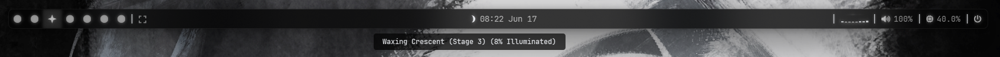

# YASB Astronomical Moon Phase Widget

An ultra-precise, high-granularity moon phase widget custom-built for **YASB (Yet Another Status Bar)**. 

Unlike basic 4 or 8-stage moon indicators, this widget utilizes astronomical equations (adapted from John Walker's Moontool) to track the moon's age, elongation, and solar perturbations. It maps these calculations to a complete **28-stage Nerd Font weather icon sequence** for incredibly smooth visual transitions.

## 📸 Preview

Below is an example of the widget displaying the moon icon alongside its corresponding high-granularity tooltip:



## ✨ Features

* **High Granularity:** Uses a full 28-stage Nerd Font icon sequence (`\ue38d` to `\ue3ae`) to perfectly match the current lunar progression.
* **Astronomical Precision:** Calculates Keplerian and orbital constants to output precise percentage illumination and exact phase names.
* **Lightweight & Efficient:** Executes via an optimized Python backend script that outputs clean JSON data directly to YASB.

## 🛠️ Installation & Setup

### 1. The Script
Save the Python calculation script as `moon_phase.py` inside your scripts directory. Ensure you have a Nerd Font installed (the CSS is pre-configured for `JetBrainsMono NFP`).

### 2. YASB Configuration (`config.yaml`)
Add the custom widget configuration to your YASB setup. Don't forget to update the `run_cmd` path to point to your local script location:

```yaml
moon_phase:
  type: "yasb.custom.CustomWidget"
  options:
    label: "{data[icon]}  "
    tooltip: true
    tooltip_label: "{data[name]} ({data[illumination]} Illuminated)"
    class_name: "moon-phase"
    exec_options:
      run_cmd: "python D:/Dotfiles/yasb/scripts/moon_phase.py" # <-- Change this to your path
      run_interval: 43200000 # Refreshes every 12 hours
      return_format: "json"
      use_shell: true
    callbacks:
      on_left: "do_nothing"
      on_right: "do_nothing"
      on_middle: "do_nothing"

```

### 3. Styling (`styles.css`)

Add the following CSS styles to your YASB stylesheet to achieve the clean text-glow and tooltip formatting shown in preview image:

```css
/* MOON WIDGET STYLING */
.moon-phase .widget-container .label {
  color: #e5e7eb;
  font-family: "JetBrainsMono NFP";
  font-size: 16px;
  font-weight: bold;
  display: inline-block;
  overflow: visible;
  padding: 0 10px;
  margin-right: -6px;
  text-shadow: 0 0 14px rgba(255, 255, 255, 0.7);
}

.tooltip {
  background-color: #000000B3;
  border-radius: 4px;
  color: #e5e7eb;
  padding: 6px 12px;
  font-size: 12px;
  font-family: "JetBrainsMono NFP";
  font-weight: 600;
  margin-top: 4px;
}
